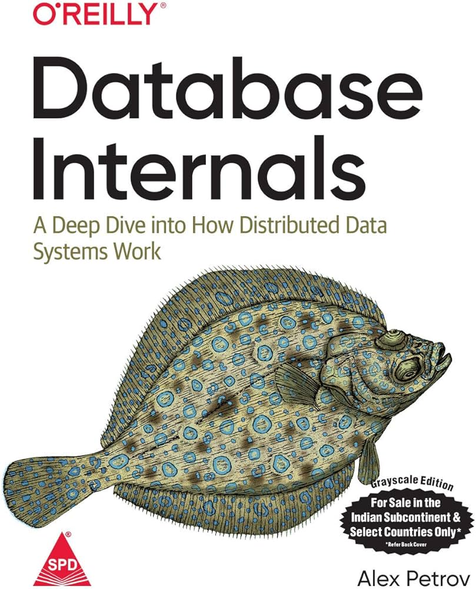

# **Database Internals -** NOTES

This repository is a rip-off [Akshat-Jain](https://github.com/Akshat-Jain/database-internals-notes#what-is-this)’s notes from reading Database Internals by Alex Petrov as well as my own thoughts and findings from the book and other related materials.

---

### Table Of Contents

### PART 1: Storage Engines

- Chapter 1: Introduction and Overview
- Chapter 2: B-tree Basics
- Chapter 3: File Formats

### What can you expect from this repository?

1. We plan on reading a chapter per week. I will try my best to update this repository with my notes from the chapter every week.
2. I will try to keep the notes as concise as possible, while also trying to cover all the important points.
3. You can expect to find some additional information that I found interesting, or some side learning that I did while reading the chapter. I'd put them with a ✨ **Side learning** label. These are not in the book, not in that chapter atleast.
4. You can expect to find my most interesting takeaways from the chapter with a 🤯 label.
5. You can expect a 1:1 mapping of the chapter with the notes. I will try to keep the notes in the same order as the chapter.

## What should you NOT expect from this repository?

This is NOT a replacement for the book. This is just my notes from the book. I'd highly recommend reading the book yourself and use this repository as a supplement / future reference.

No amount of short notes can justify the amount of knowledge that the book contains, so would highly encourage you to read the book yourself.

## Key takeaways

Each chapter would contain a **Key takeaways** section as the parts that I find most relevant to me.

## Motivation

My motivation comes from the urge to know more about databases especially now that I’m actively contributing to [FerretDB](https://github.com/FerretDB/FerretDB). I’m trying to get to know more about database architectures and how databases work under the hood as this would help me make better informed decisions. I also hope to discover a couple things from this book that might be beneficial to FerretDB and help improve it’s overall performance.
